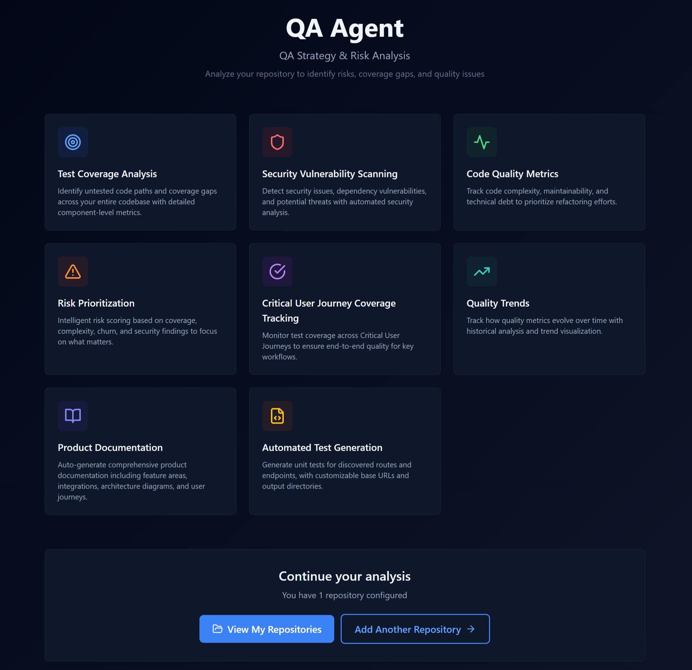

# QA Agent

A Python QA automation framework that discovers API routes, assesses risks, generates runnable test suites, orchestrates test execution, and produces reports. Exposes tooling via CLI (Typer) and MCP (Model Context Protocol). Local-first, works on macOS (including Apple Silicon) and Windows.



## Features

- **Route Discovery** - Extract API routes from OpenAPI specs, source code (FastAPI, Flask, Django, Next.js), or live UI crawling
- **Risk Assessment** - 16+ pluggable rules across security, performance, and reliability categories, extensible with custom YAML rules
- **Test Generation** - Produce runnable pytest, Behave BDD, and Playwright E2E test suites with optional RAG context
- **Test Orchestration** - Run generated suites with retry, JUnit parsing, parallel execution, and failure diagnostics
- **Browser Recording** - Record browser interactions and export as Playwright specs or Behave features
- **DOM Analysis** - Inspect live pages for selector coverage, form structure, and testability gaps
- **App Documentation** - Auto-generate feature maps, integration detection, CUJ discovery, and architecture diagrams
- **Coverage Gap Analysis** - Identify untested routes by comparing OpenAPI specs against JUnit artifacts
- **CI/CD Generation** - Generate GitHub Actions and GitLab CI pipeline templates
- **Reporting** - Markdown/HTML reports, interactive dashboards, executive summaries
- **MCP Server** - Expose QA tools to AI agents via Model Context Protocol
- **LLM Integration** - Optional LLM enhancement via Ollama (local) or cloud APIs (Claude, GPT) through litellm

## System Requirements

- **Python**: 3.11+ (< 3.13)
- **Platform**: macOS (including M1/M2/M3) or Windows
- **Memory**: 8GB+ RAM
- **LLM**: Optional - works without any LLM; all features have template fallbacks

## Quickstart

```bash
# Create and activate a virtual environment
python3.11 -m venv .venv
source .venv/bin/activate  # macOS/Linux
# .venv\Scripts\activate   # Windows

# Install (choose extras you need)
pip install -e .                    # Core
pip install -e .[api]               # + API testing (Schemathesis)
pip install -e .[ui]                # + UI testing (Playwright, recording, DOM analysis)
pip install -e .[llm]              # + LLM providers (Ollama, litellm)
pip install -e .[mcp]              # + MCP server
pip install -e .[report,config,cov,perf]  # + Reporting, config, coverage, perf

# Verify installation
qaagent doctor
```

## Usage

### Configure a Target

```bash
# Initialize a project profile
qaagent config init . --template fastapi --name my-api
qaagent use my-api

# Or point at an existing OpenAPI spec
qaagent analyze routes --openapi openapi.yaml --out routes.json
```

### Discover Routes

```bash
# From OpenAPI spec
qaagent analyze routes --openapi openapi.yaml --format json --out routes.json

# From source code (FastAPI, Flask, Django)
qaagent analyze routes --source-dir ./src --out routes.json

# From live UI crawling (requires [ui] extra)
qaagent analyze routes --crawl --crawl-url https://myapp.local:3000 --crawl-depth 3

# Combine sources (OpenAPI + crawl results are merged and deduplicated)
qaagent analyze routes --openapi openapi.yaml --crawl --crawl-url https://myapp.local:3000

# Generate strategy from discovered routes
qaagent analyze strategy --routes-file routes.json --out strategy.yaml
```

### Analyze DOM Structure

Inspect live pages for selector coverage, forms, and testability (requires `[ui]` extra):

```bash
# Analyze a page's DOM and selector strategy
qaagent analyze dom --url https://myapp.local:3000 --out dom-analysis.json

# With authentication
qaagent analyze dom --url https://myapp.local:3000 \
  --auth-token-env API_TOKEN --storage-state .auth/state.json
```

### Assess Risks

```bash
# Risk assessment from collected evidence
qaagent analyze risks <run-id> --config risk_config.yaml --json-out risks.json

# Coverage gap analysis (OpenAPI vs JUnit test results)
qaagent analyze coverage-gaps --openapi openapi.yaml --junit reports/junit.xml --markdown gaps.md
```

### Manage Risk Rules

```bash
# List all risk rules (built-in + custom YAML rules)
qaagent rules list

# Show details for a specific rule
qaagent rules show SEC-001

# Validate a custom rules YAML file
qaagent rules validate path/to/custom_rules.yaml
```

### Generate Tests

```bash
# Generate pytest unit tests
qaagent generate unit-tests --routes-file routes.json --out tests/unit

# Generate Behave BDD scenarios
qaagent generate behave --routes-file routes.json --out tests/behave

# Generate Playwright E2E project (TypeScript)
qaagent generate e2e --routes-file routes.json --out tests/e2e

# Generate all enabled suites from .qaagent.yaml
qaagent generate all

# Generate CI/CD pipeline
qaagent generate ci --platform github --framework fastapi
qaagent generate ci --platform gitlab --framework django

# RAG-enhanced generation (uses local codebase context)
qaagent rag index                    # Build retrieval index
qaagent gen-tests --openapi openapi.yaml --use-rag --rag-top-k 5
```

### Record Browser Flows

Capture browser interactions and export as test code (requires `[ui]` extra):

```bash
# Record a user flow
qaagent record --name checkout_flow --url https://myapp.local:3000/checkout

# Export to specific framework (default: both)
qaagent record --name login --url https://myapp.local:3000/login --export playwright

# With authentication and custom settings
qaagent record --name admin_flow --url https://myapp.local:3000/admin \
  --auth-token-env API_TOKEN --storage-state .auth/state.json \
  --timeout 60 --max-actions 200 --headed
```

Recording produces:
- `recording.json` — normalized action timeline
- `recorded_<name>.spec.ts` — Playwright TypeScript test
- `recorded_<name>.feature` + step stubs — Behave BDD scenario

Sensitive inputs (passwords, tokens) are automatically redacted. Selectors prefer stable attributes (`data-testid` > ARIA > `id`/`name` > CSS fallback).

### Run Tests

```bash
# Run pytest
qaagent pytest-run --path tests --cov --cov-target src

# Run all generated suites with orchestration
qaagent run-all

# Run suites in parallel
qaagent run-all --parallel --max-workers 4

# Full pipeline: discover -> assess -> generate -> run -> report
qaagent plan-run --generate
```

### Generate App Documentation

Auto-discover features, integrations, CUJs, and architecture from your codebase:

```bash
# Generate documentation
qaagent doc generate --source src/ --openapi openapi.yaml

# Display in terminal
qaagent doc show --section features

# Export to markdown or JSON
qaagent doc export --format markdown --output app-docs.md

# Show discovered critical user journeys
qaagent doc cujs --format table
```

### RAG Indexing

Build a local retrieval index for context-aware test generation:

```bash
# Index your repository
qaagent rag index --path . --json-out

# Query for relevant code snippets
qaagent rag query "authentication flow" --top-k 5
```

### Reports

```bash
# Generate findings report
qaagent report --fmt html --out reports/findings.html

# Interactive dashboard
qaagent dashboard

# Executive summary (LLM-enhanced if available)
qaagent summarize --out reports/summary.md

# Open in browser
qaagent open-report --path reports/findings.html
```

### Additional Tools

```bash
# API property-based testing
qaagent schemathesis-run --openapi openapi.yaml --base-url http://localhost:8000

# Accessibility
qaagent a11y-run --url https://example.com --tag wcag2a

# Performance
qaagent perf-run --users 25 --spawn-rate 5 --run-time 2m

# Lighthouse audit
qaagent lighthouse-audit --url https://example.com
```

### MCP Server

```bash
qaagent-mcp  # Starts MCP server over stdio
```

Exposes 11 tools to AI agents: `discover_routes`, `assess_risks`, `analyze_application`, `detect_openapi`, `generate_tests`, `schemathesis_run`, `pytest_run`, `generate_report_tool`, `a11y_run`, `lighthouse_audit`, `summarize_findings`.

See [MCP and Agents Guide](docs/MCP_AND_AGENTS_GUIDE.md) for Claude Desktop integration and agent patterns.

## Project Structure

```
src/qaagent/
  cli.py                    # Typer CLI entry point
  commands/                 # CLI command modules
    analyze_cmd.py          #   Route discovery, risks, DOM analysis, coverage gaps, strategy
    generate_cmd.py         #   Test & CI/CD generation
    run_cmd.py              #   Test execution (pytest, playwright, schemathesis, etc.)
    report_cmd.py           #   Reporting and dashboards
    config_cmd.py           #   Configuration management
    targets_cmd.py          #   Target registry management
    workspace_cmd.py        #   Workspace artifact management
    doc_cmd.py              #   App documentation generation
    rules_cmd.py            #   Risk rule management (list, show, validate)
    rag_cmd.py              #   RAG index and query
    record_cmd.py           #   Browser flow recording
    misc_cmd.py             #   Utilities (doctor, fix, gen-tests, api, web-ui)
  analyzers/
    route_discovery.py      # OpenAPI + source code + UI crawl route extraction
    risk_assessment.py      # Pluggable risk rule engine
    dom_analyzer.py         # Live DOM inspection with Playwright
    ui_crawler.py           # BFS UI crawling for runtime route discovery
    route_coverage.py       # Route-level coverage gap analysis
    strategy_generator.py   # Test strategy recommendations
    rules/                  # Risk rules (16 built-in + custom YAML rules)
      base.py               #   RiskRuleRegistry + severity overrides
      yaml_loader.py        #   Custom rule YAML loading + validation
      yaml_rule.py          #   YAML-defined rule evaluation
  discovery/
    base.py                 # FrameworkParser ABC + RouteParam model
    fastapi_parser.py       # AST-based FastAPI route extraction
    flask_parser.py         # AST-based Flask/Blueprint parsing
    django_parser.py        # URL patterns + DRF ViewSet parsing
    nextjs_parser.py        # Next.js App Router discovery
  generators/
    base.py                 # BaseGenerator ABC + GenerationResult
    unit_test_generator.py  # pytest test generation
    behave_generator.py     # BDD scenario generation
    playwright_generator.py # Playwright TypeScript E2E generation
    cicd_generator.py       # GitHub Actions / GitLab CI templates
    llm_enhancer.py         # LLM-powered test enhancement with RAG context
    validator.py            # Syntax validation + auto-fix
  recording/
    models.py               # RecordedAction, RecordedFlow, SelectorCandidate
    recorder.py             # DOM event capture with Playwright
    selectors.py            # Deterministic selector ranking
    export_playwright.py    # Playwright spec export
    export_behave.py        # Behave feature + step stub export
  rag/
    models.py               # RagDocument, RagChunk, RagSearchResult
    indexer.py              # Repository indexing with chunking
    retriever.py            # Lexical search with scoring
  doc/
    models.py               # AppDocumentation, FeatureArea, Integration, CUJ
    generator.py            # Documentation orchestrator
    feature_grouper.py      # Route-to-feature grouping
    integration_detector.py # External service detection (AST-based)
    cuj_discoverer.py       # Critical user journey auto-discovery
    graph_builder.py        # Architecture diagram generation
    prose.py                # LLM prose synthesis with template fallback
    markdown_export.py      # Markdown rendering
  runners/
    base.py                 # TestRunner ABC + TestCase/TestResult models
    pytest_runner.py        # pytest subprocess wrapper
    playwright_runner.py    # Playwright subprocess wrapper
    behave_runner.py        # Behave subprocess wrapper
    orchestrator.py         # Config-driven suite execution with retry + parallel
    diagnostics.py          # Heuristic + LLM failure analysis
    junit_parser.py         # Generic JUnit XML parser
  config/
    models.py               # Pydantic config models (QAAgentProfile, etc.)
    loader.py               # Config discovery and loading
    templates.py            # Config templates (generic, fastapi, nextjs)
  llm.py                    # Multi-provider LLM client via litellm
  mcp_server.py             # MCP server exposing 11 QA tools
  templates/                # Jinja2 templates (Playwright, CI/CD, unit tests)
```

## Configuration

qaagent uses `.qaagent.yaml` profiles per project:

```yaml
project:
  name: my-api
  type: fastapi              # generic, fastapi, flask, django, nextjs

app:
  dev:
    base_url: http://localhost:8000
    health_endpoint: /health
    headers:                   # Custom request headers
      X-API-Key: "..."
    auth:
      header_name: Authorization
      token_env: API_TOKEN     # Environment variable with token
      prefix: "Bearer "

openapi:
  spec_path: openapi.yaml
  source_dir: src

tests:
  unit:
    enabled: true
    output_dir: tests/qaagent/unit
  behave:
    enabled: true
    output_dir: tests/qaagent/behave
  e2e:
    enabled: false
    output_dir: tests/qaagent/e2e

run:
  retry_count: 0               # Retries for failed tests
  timeout: 300                 # Per-suite timeout in seconds
  suite_order: [unit, behave, e2e]
  parallel: false              # Run suites concurrently
  max_workers: null            # Defaults to number of enabled suites

risk_assessment:
  disable_rules: []            # e.g. ["SEC-002", "PERF-004"]
  custom_rules_file: null      # Path to custom YAML rules file
  severity_overrides: {}       # Override rule severities: {"SEC-001": "critical"}

doc:
  exclude_features: []         # Feature tags to exclude from docs
  custom_summary: null         # Custom app summary text

llm:
  enabled: false
  provider: ollama
  model: qwen2.5-coder:7b
  fallback_to_templates: true
```

### Multi-Project Management

```bash
qaagent targets add my-api /path/to/api-project --type fastapi
qaagent targets add dashboard /path/to/frontend --type nextjs
qaagent targets list
qaagent use my-api    # Switch active target
```

Commands automatically use the active profile's base URL, auth settings, and headers when available.

## LLM Setup (Optional)

All features work without LLM - test generators fall back to templates.

**Local (Ollama):**
```bash
brew install ollama
ollama pull llama3.2:3b
ollama serve
```

**Cloud APIs (via litellm):**
Set environment variables for your provider (e.g., `ANTHROPIC_API_KEY`, `OPENAI_API_KEY`). litellm handles routing.

## Examples

[`examples/petstore-api`](examples/petstore-api/) includes a FastAPI service, OpenAPI spec, and sample config:

```bash
pip install -r examples/petstore-api/requirements.txt
uvicorn server:app --app-dir examples/petstore-api --port 8765

# In another terminal
qaagent analyze routes --openapi examples/petstore-api/openapi.yaml --out routes.json
qaagent generate unit-tests --routes-file routes.json --out /tmp/tests
qaagent report --fmt html --out reports/findings.html
```

## Additional Guides

- **[UI Getting Started](docs/UI_GETTING_STARTED.md)** - Visual guide to using QA Agent from the web interface (start here if you prefer GUIs)
- [Workspace Guide](docs/WORKSPACE_GUIDE.md) - Managing generated artifacts with review-and-approve workflow
- [MCP and Agents Guide](docs/MCP_AND_AGENTS_GUIDE.md) - AI agent integration and Claude Desktop setup
- [Windows Setup](docs/WINDOWS_SETUP.md) - Platform-specific installation for Windows
- [Mac M1 Validation](docs/MAC_M1_VALIDATION.md) - Apple Silicon validation checklist
- [Hybrid Setup](docs/HYBRID_SETUP.md) - Multi-machine LLM setup (Mac + Windows GPU)

## License

This project is provided as-is for learning and personal use.
