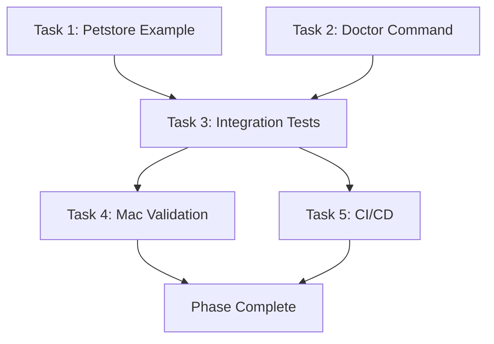

# Phase 1: Implementation Plan (AGREED)

**Date**: 2025-10-22
**Status**: ✅ APPROVED - Ready for Implementation
**Agents**: Claude (review) + Codex (implementation)
**Timeline**: 1.5-2 days implementation + 0.5 day validation

---

## Scope (Final Agreement)

### In Scope
1. ✅ FastAPI petstore example with canned configs
2. ✅ `qaagent doctor` health check command
3. ✅ Integration test suite (plain pytest)
4. ✅ Mac M1 validation + Playwright ARM docs
5. ✅ CI/CD (macOS + Ubuntu)

### Deferred to Phase 2
- ⏭️ Interactive quickstart wizard
- ⏭️ React todo app example
- ⏭️ Windows CI support
- ⏭️ pytest-bdd integration

### Already Complete
- ✅ .gitignore enhancement
- ✅ Requirements.txt files
- ✅ SETUP.md for Mac
- ✅ Agent collaboration docs

---

## Implementation Tasks

### Task 1: Examples - Petstore API
**Owner**: Codex
**Estimate**: 3-4 hours
**Priority**: P0 (blocking everything else)

**Deliverables**:
```
examples/
├── README.md
└── petstore-api/
    ├── README.md           # Quick start guide
    ├── openapi.yaml        # OpenAPI 3.0 spec
    ├── server.py           # FastAPI implementation
    ├── requirements.txt    # fastapi, uvicorn
    ├── .qaagent.toml       # Pre-configured for this example
    ├── .env.example        # Template with BASE_URL
    └── tests/
        └── test_generated_api.py  # Sample generated tests
```

**Acceptance Criteria**:
- [ ] FastAPI server runs with `uvicorn server:app`
- [ ] OpenAPI spec is valid (validates at swagger.io)
- [ ] Spec has 5+ endpoints (GET, POST, PUT, DELETE examples)
- [ ] .qaagent.toml points to local spec and server
- [ ] README has copy-paste quick start (< 5 commands)
- [ ] Can run full workflow: `qaagent analyze` → `qaagent schemathesis-run` → `qaagent report`

**Testing**:
- Manual: Follow README, verify workflow works
- Will be used by integration tests in Task 3

**Dependencies**: None

**Technical Notes**:
- Use FastAPI (modern, auto OpenAPI generation)
- Include CORS middleware for future frontend
- Simple in-memory data (no database)
- Sample endpoints: `/pets`, `/pets/{id}`, `/owners`, etc.
- Include at least one endpoint with path params, query params, request body

---

### Task 2: Doctor Command
**Owner**: Codex
**Estimate**: 2-3 hours
**Priority**: P0

**Implementation**:
File: `src/qaagent/cli.py` (add command)
File: `src/qaagent/doctor.py` (new module for health checks)

**Health Checks**:
```python
# src/qaagent/doctor.py
from dataclasses import dataclass
from enum import Enum

class HealthStatus(Enum):
    OK = "ok"
    WARNING = "warning"
    ERROR = "error"

@dataclass
class HealthCheck:
    name: str
    status: HealthStatus
    message: str
    suggestion: str | None = None

def check_python_version() -> HealthCheck: ...
def check_installed_extras() -> list[HealthCheck]: ...
def check_system_deps() -> list[HealthCheck]: ...
def check_ollama() -> HealthCheck: ...
def check_mcp_server() -> HealthCheck: ...
```

**CLI Command**:
```python
@app.command()
def doctor():
    """Check system health and dependencies."""
    checks = []
    checks.append(check_python_version())
    checks.extend(check_installed_extras())
    checks.extend(check_system_deps())
    if llm_extras_installed():
        checks.append(check_ollama())
    checks.append(check_mcp_server())

    # Display in table (green/yellow/red)
    # Exit code: 0 if all ok/warning, 1 if any error
```

**Checks to Include**:
1. **Python Version**:
   - ✅ 3.11 or 3.12
   - ⚠️ 3.13 (warn: some packages may not work)
   - ❌ < 3.11

2. **Installed Extras**:
   - Check for: mcp, schemathesis, playwright, ollama, jinja2
   - Show installed ✅ / missing ⚠️
   - Suggest: `pip install -e .[extra]`

3. **System Dependencies**:
   - Node.js (for Lighthouse): `which node`
   - Playwright browsers: check `~/.cache/ms-playwright/`
   - Git: `which git`

4. **Ollama** (if llm extras installed):
   - Running: try `http://localhost:11434/api/tags` with 2s timeout
   - Models: list available models if running

5. **MCP Server**:
   - Startup test: `subprocess.run(["qaagent-mcp"], timeout=5)`
   - Verify it doesn't crash immediately

**Acceptance Criteria**:
- [ ] All 5 check categories implemented
- [ ] Rich table output with colors (green ✓, yellow ⚠, red ✗)
- [ ] Helpful suggestions for each failed check
- [ ] Completes in < 5 seconds (with timeouts on slow checks)
- [ ] Exit code 0 if healthy, 1 if any errors
- [ ] Works when optional extras not installed (graceful)
- [ ] JSON output option: `qaagent doctor --json-out`

**Testing**:
```python
# tests/integration/test_doctor_command.py
def test_doctor_runs_without_error():
    result = subprocess.run(["qaagent", "doctor"])
    assert result.returncode in [0, 1]  # Should not crash

def test_doctor_json_output():
    result = subprocess.run(
        ["qaagent", "doctor", "--json-out"],
        capture_output=True
    )
    data = json.loads(result.stdout)
    assert "checks" in data
```

**Dependencies**: None (but nicer to test with Task 1 example)

---

### Task 3: Integration Test Suite
**Owner**: Codex
**Estimate**: 2-3 hours
**Priority**: P1 (after Tasks 1-2)

**File Structure**:
```
tests/
├── conftest.py           # NEW: Shared fixtures
├── unit/                 # Move existing tests here
│   ├── test_llm.py
│   ├── test_report.py
│   └── ...
└── integration/          # NEW: E2E tests
    ├── test_api_workflow.py
    ├── test_mcp_server.py
    ├── test_doctor_command.py
    └── test_ui_workflow.py
```

**Shared Fixtures** (`tests/conftest.py`):
```python
import pytest
import subprocess
from pathlib import Path

@pytest.fixture(scope="session")
def petstore_server():
    """Start petstore API for integration tests."""
    proc = subprocess.Popen(
        ["uvicorn", "examples.petstore-api.server:app", "--port", "8765"],
        cwd=Path(__file__).parent.parent,
    )
    time.sleep(2)  # Wait for startup
    yield "http://localhost:8765"
    proc.terminate()
    proc.wait()

@pytest.fixture
def temp_workspace(tmp_path):
    """Temporary workspace with config."""
    (tmp_path / ".qaagent.toml").write_text(
        "[api]\nopenapi = 'spec.yaml'\nbase_url = 'http://localhost:8765'"
    )
    return tmp_path
```

**Test Files**:

**`test_api_workflow.py`**:
```python
def test_full_api_workflow(petstore_server, tmp_path):
    """Test: analyze → detect → schemathesis → report."""
    # 1. Analyze detects OpenAPI
    result = subprocess.run(["qaagent", "analyze", "examples/petstore-api"])
    assert result.returncode == 0

    # 2. Detect OpenAPI
    result = subprocess.run([
        "qaagent", "api-detect",
        "--path", "examples/petstore-api",
        "--base-url", petstore_server,
        "--probe"
    ], capture_output=True)
    assert "openapi.yaml" in result.stdout.decode()

    # 3. Run Schemathesis
    result = subprocess.run([
        "qaagent", "schemathesis-run",
        "--openapi", "examples/petstore-api/openapi.yaml",
        "--base-url", petstore_server,
        "--outdir", str(tmp_path / "reports")
    ])
    assert result.returncode == 0
    assert (tmp_path / "reports" / "junit.xml").exists()

    # 4. Generate report
    result = subprocess.run([
        "qaagent", "report",
        "--out", str(tmp_path / "findings.md"),
        "--sources", str(tmp_path / "reports" / "junit.xml")
    ])
    assert result.returncode == 0
    assert (tmp_path / "findings.md").exists()
```

**`test_mcp_server.py`**:
```python
import asyncio
import json

async def test_mcp_server_startup():
    """Test MCP server starts and responds to initialize."""
    proc = await asyncio.create_subprocess_exec(
        "qaagent-mcp",
        stdin=asyncio.subprocess.PIPE,
        stdout=asyncio.subprocess.PIPE,
        stderr=asyncio.subprocess.PIPE
    )

    # Send JSON-RPC initialize
    init_msg = {
        "jsonrpc": "2.0",
        "id": 1,
        "method": "initialize",
        "params": {"protocolVersion": "1.0"}
    }
    proc.stdin.write((json.dumps(init_msg) + "\n").encode())
    await proc.stdin.drain()

    # Read response
    line = await asyncio.wait_for(proc.stdout.readline(), timeout=5.0)
    response = json.loads(line)

    assert response["jsonrpc"] == "2.0"
    assert "result" in response

    proc.terminate()
    await proc.wait()

async def test_mcp_tool_invocation(petstore_server):
    """Test calling detect_openapi tool."""
    # Similar to above but call detect_openapi tool
    # Verify response schema
    pass
```

**`test_doctor_command.py`**: (Covered in Task 2)

**`test_ui_workflow.py`** (optional, can defer):
```python
def test_playwright_scaffold_and_run(tmp_path):
    """Test UI workflow: scaffold → run."""
    # Scaffold tests
    # Run against example.com
    # Verify output
    pass
```

**Acceptance Criteria**:
- [ ] All existing tests moved to `tests/unit/`
- [ ] Shared fixtures in `conftest.py`
- [ ] API workflow test passes
- [ ] MCP server test passes
- [ ] Doctor command test passes
- [ ] Tests run in < 30 seconds (excluding server startup)
- [ ] Can run: `pytest tests/integration/ -v`
- [ ] Can run: `pytest -v` (runs all tests)

**Testing**: These ARE the tests! But verify they all pass.

**Dependencies**: Tasks 1 (petstore) and 2 (doctor)

---

### Task 4: Mac M1 Validation & Docs
**Owner**: Codex (docs) + User (testing)
**Estimate**: 2-3 hours (includes user time)
**Priority**: P1

**Documentation Updates**:

**`SETUP.md` additions**:
```markdown
## Playwright on Mac M1/M2/M3

### Quick Install
```bash
pip install -e .[ui]
npx playwright install --with-deps
```

### Troubleshooting

**WebKit fails on macOS Sonoma**:
System Settings → Privacy & Security → Developer Tools → Add Terminal

**Missing FFmpeg**:
```bash
brew install ffmpeg
```

**Slow headed mode**:
Use headless for faster execution (headed on ARM is slower than x86)

### No Rosetta Required
Playwright works natively on Apple Silicon - no need for Rosetta 2!
```

**`docs/MAC_M1_VALIDATION.md`** (new file):
```markdown
# Mac M1/M2/M3 Validation Checklist

This document tracks validation of the project on Apple Silicon.

## Environment
- [ ] Mac Mini/MacBook with M1/M2/M3 chip
- [ ] macOS Sonoma or later
- [ ] Python 3.11 installed via Homebrew

## Installation
- [ ] Clone repo
- [ ] Create venv: `python3.11 -m venv .venv`
- [ ] Activate: `source .venv/bin/activate`
- [ ] Install base: `pip install -e .`
- [ ] Install extras: `pip install -e .[mcp,api,ui,llm]`

## Health Check
- [ ] Run: `qaagent doctor`
- [ ] All checks pass or show warnings (not errors)

## Examples
- [ ] Navigate to `examples/petstore-api/`
- [ ] Follow README.md
- [ ] Server starts without errors
- [ ] Full workflow completes: analyze → test → report

## CLI Commands
- [ ] `qaagent --help` (shows commands)
- [ ] `qaagent analyze .` (detects project)
- [ ] `qaagent schemathesis-run` (works with petstore)
- [ ] `qaagent playwright-install` (installs browsers)
- [ ] `qaagent ui-run` (runs against example.com)
- [ ] `qaagent report` (generates findings)

## MCP Server
- [ ] `qaagent-mcp` starts without errors
- [ ] Ctrl+C stops cleanly

## Integration Tests
- [ ] `pytest tests/integration/ -v` (all pass)

## Playwright Specific
- [ ] Chromium works
- [ ] Firefox works
- [ ] WebKit works (may need settings on Sonoma)
- [ ] Video recording works (needs FFmpeg)

## Ollama (Optional)
- [ ] `brew install ollama`
- [ ] `ollama serve`
- [ ] `ollama pull llama3.2:3b`
- [ ] `qaagent gen-tests` (uses LLM)

## Issues Found
[Document any issues here]

## Sign-off
- [ ] All critical items pass
- [ ] Warnings documented
- [ ] Ready for production use

Validated by: ___________
Date: ___________
```

**Acceptance Criteria**:
- [ ] SETUP.md has Playwright M1 section
- [ ] MAC_M1_VALIDATION.md created
- [ ] User completes validation checklist
- [ ] All critical items pass
- [ ] Any issues documented with workarounds

**Testing**: User manually tests on Mac M1

**Dependencies**: Tasks 1-3 must be complete

---

### Task 5: CI/CD Pipeline
**Owner**: Codex
**Estimate**: 1-2 hours
**Priority**: P2 (nice to have, can be last)

**File**: `.github/workflows/test.yml`

```yaml
name: Tests

on:
  push:
    branches: [main]
  pull_request:
    branches: [main]

jobs:
  test:
    runs-on: ${{ matrix.os }}
    strategy:
      matrix:
        os: [macos-latest, ubuntu-latest]
        python-version: ["3.11", "3.12"]

    steps:
      - uses: actions/checkout@v4

      - name: Set up Python
        uses: actions/setup-python@v5
        with:
          python-version: ${{ matrix.python-version }}

      - name: Install dependencies
        run: |
          python -m pip install --upgrade pip
          pip install -e .[mcp,api,ui,cov]

      - name: Install Playwright browsers (UI tests)
        run: |
          npx playwright install --with-deps chromium

      - name: Lint with ruff
        run: |
          pip install ruff
          ruff check src/ tests/

      - name: Type check with mypy
        run: |
          pip install mypy
          mypy src/ || true  # Don't fail on mypy errors initially

      - name: Run unit tests
        run: |
          pytest tests/unit/ -v --cov=src/qaagent --cov-report=xml

      - name: Run integration tests
        run: |
          pytest tests/integration/ -v

      - name: Upload coverage
        if: matrix.os == 'ubuntu-latest' && matrix.python-version == '3.11'
        uses: codecov/codecov-action@v3
        with:
          file: ./coverage.xml
```

**Additional File**: `.github/workflows/lint.yml` (optional, quick)

```yaml
name: Lint

on: [push, pull_request]

jobs:
  lint:
    runs-on: ubuntu-latest
    steps:
      - uses: actions/checkout@v4
      - uses: actions/setup-python@v5
        with:
          python-version: "3.11"
      - run: |
          pip install ruff black
          ruff check src/ tests/
          black --check src/ tests/
```

**Acceptance Criteria**:
- [ ] CI runs on push to main
- [ ] CI runs on pull requests
- [ ] Tests run on macOS + Ubuntu
- [ ] Tests run on Python 3.11 + 3.12
- [ ] Linting catches style issues
- [ ] Coverage report uploaded (Ubuntu 3.11 only)
- [ ] Badge added to README: 

**Testing**: Create a test PR, verify CI runs

**Dependencies**: Tasks 1-3 (needs tests to run)

---

## Task Dependencies



**Execution Order**:
1. **Parallel**: Task 1 (petstore) + Task 2 (doctor) - no dependencies
2. **Sequential**: Task 3 (integration tests) - needs 1 & 2
3. **Parallel**: Task 4 (validation) + Task 5 (CI) - both need 3
4. **Final**: User sign-off

---

## Quality Gates

### Before Task Completion
Each task must have:
- [ ] Code implemented
- [ ] Tests passing (unit + integration where applicable)
- [ ] Documentation updated
- [ ] Self-reviewed by Codex
- [ ] Committed with good message

### Before Phase Completion
- [ ] All 5 tasks complete
- [ ] Integration tests pass on Mac
- [ ] User validation complete
- [ ] CI pipeline green
- [ ] README updated with badges
- [ ] No critical bugs

---

## Communication Plan

### Daily Check-ins
Codex posts update:
- Tasks completed
- Tasks in progress
- Blockers (if any)
- Questions for Claude

### Review Trigger
When a major task is done (1, 2, or 3):
- Codex: "Task X complete, ready for review"
- Claude: Reviews within 24h
- Iterate on feedback

### Final Review
When all tasks done:
- Codex: "All tasks complete, ready for validation"
- Claude: Full review
- User: Mac M1 testing
- All: Address any issues
- User: Final approval

---

## Success Metrics

### Code Quality
- [ ] All tests pass
- [ ] No linting errors (ruff)
- [ ] Type hints present (mypy clean preferred)
- [ ] Coverage > 70% (unit tests)

### User Experience
- [ ] Examples work in < 5 minutes
- [ ] Doctor command is helpful
- [ ] Error messages suggest fixes
- [ ] Documentation is accurate

### Platform Support
- [ ] Works on Mac M1 (primary)
- [ ] Works on Ubuntu (CI verified)
- [ ] Playwright on ARM documented
- [ ] No platform-specific hardcoding

---

## Risk Mitigation

| Risk | Likelihood | Impact | Mitigation |
|------|------------|--------|------------|
| Petstore too simple | Low | Low | Add 5+ endpoints, various HTTP methods |
| Integration tests flaky | Medium | Medium | Use fixtures, proper startup waits |
| MCP testing complex | Medium | Medium | Start with simple handshake, enhance later |
| Mac validation finds issues | Medium | High | Allocate time for fixes, iterate |
| CI setup delays | Low | Low | Task 5 is P2, can ship without it |

---

## Definition of Done

Phase 1 is complete when:
- ✅ All 5 tasks have passing acceptance criteria
- ✅ User can follow examples/petstore-api/README and succeed
- ✅ `qaagent doctor` shows green on Mac M1
- ✅ Integration tests pass on Mac M1
- ✅ CI pipeline is green (or setup, even if not green yet)
- ✅ docs/MAC_M1_VALIDATION.md signed off by user
- ✅ No P0 bugs

**Then**: Ready for Phase 2 (new features, agent loop, etc.)

---

**Status**: ✅ APPROVED - Ready for Implementation

**Next Action**: Codex begins Task 1 (Petstore Example)

**Estimated Completion**: 2025-10-24 (2 days from now)
