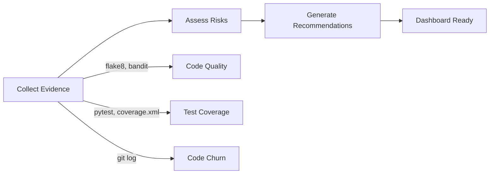
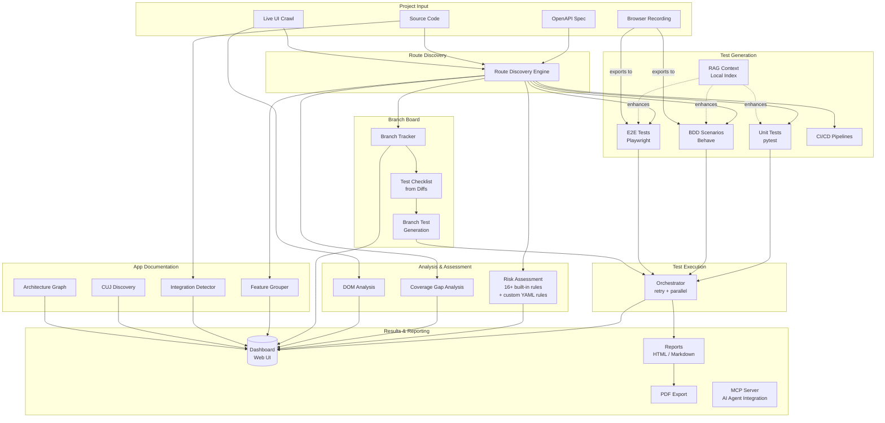
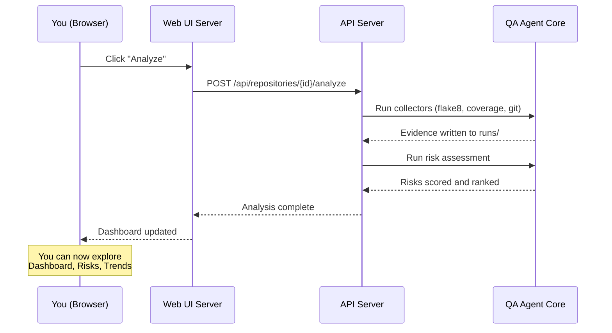
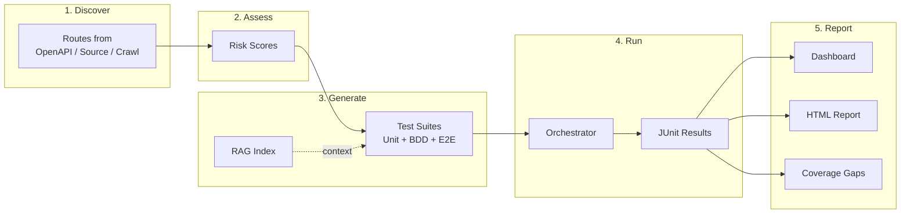
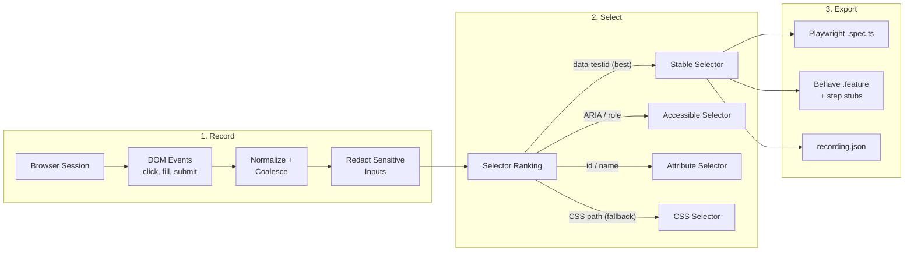
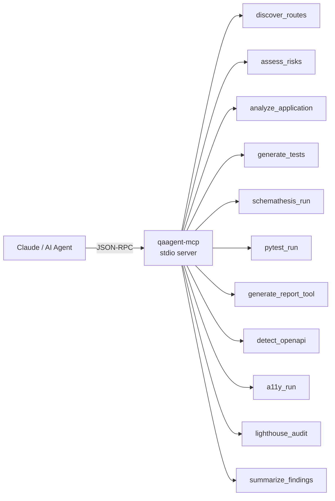

# Getting Started with QA Agent (UI Guide)

This guide walks you through QA Agent using its web interface. No CLI experience required — you'll configure projects, run analysis, and explore results entirely from the browser.

## Prerequisites

- Python 3.11 or 3.12
- A project you want to analyze (local directory with source code or an OpenAPI spec)

## 1. Install QA Agent

```bash
# Create a virtual environment
python3.11 -m venv .venv
source .venv/bin/activate    # macOS/Linux
# .venv\Scripts\activate     # Windows

# Install with UI and API extras
pip install -e ".[api,ui,report,config]"

# Verify
qaagent doctor
```

> **Tip:** Add `[llm]` for LLM-enhanced test generation, `[mcp]` for AI agent integration, or `[perf]` for performance testing. All features work without these — they just unlock additional capabilities.

## 2. Start the Web UI

```bash
# Start the web UI (includes API + WebSocket)
qaagent web-ui --port 8080
```

Your browser opens automatically to `http://localhost:8080`.

> **Standalone API:** If you only need the REST API (for CI or headless use), run `qaagent api --port 8000` instead.

## 3. Create an Admin Account

On first launch, you'll be redirected to `/setup-admin`. Create a username and password — this enables session-based authentication for the dashboard. All subsequent requests require login via `/login`.

> **Note:** When no users exist, auth is bypassed so the setup page is accessible.

## 4. Add Your First Project

From the landing page, click **Get Started** (or navigate to `/setup`).

**For a local project:**
1. Enter a **name** (e.g., `my-api`)
2. Enter the **local path** to your project (e.g., `/Users/you/projects/my-api`)
3. Select **analysis options**:
   - **Test Coverage** — collect pytest/JUnit coverage metrics
   - **Code Quality** — run flake8 and static analysis
   - **Security** — run bandit and risk assessment rules
   - **Performance** — include churn and volatility metrics
4. Click **Create Repository**

**For a GitHub project:**
1. Switch to the **GitHub** tab
2. Enter the repository URL
3. Select analysis options
4. Click **Create Repository**

Your project now appears on the **Repositories** page (`/repositories`).

## 5. Run Analysis

From the Repositories page:
1. Click your project card
2. Click **Analyze** to trigger a full analysis run

The analysis pipeline runs automatically:



When complete, the status changes to **Ready** and you can explore results.

## 6. Explore the Dashboard

Navigate to `/dashboard` to see your project's health at a glance.

### KPI Cards
Four top-level metrics appear immediately:
- **Total Runs** — how many analysis cycles you've completed
- **High Risks** — components in the P0/P1 risk bands
- **Avg Coverage** — mean test coverage across components
- **Safe Components** — components with no high-severity findings

### Top Risks
The five highest-scoring risks with their contributing factors (security issues, coverage gaps, code churn). Click any risk to see its recommendations.

### Coverage Gaps
Components with the lowest test coverage, ranked by impact.

### Recent Runs
A timeline of past analysis runs — click any run to see its full details.

### Export
Use the **Export** menu (top-right) to download results as PDF, CSV, or JSON.

## 7. Navigate the UI

The sidebar provides access to all views:

| Page | Path | What You'll Find |
|------|------|-----------------|
| **Login** | `/login` | Session authentication |
| **Dashboard** | `/dashboard` | KPIs, top risks, coverage gaps, recommendations |
| **Runs** | `/runs` | All analysis runs with search and filtering |
| **Run Details** | `/runs/{id}` | Deep dive into a single run's findings |
| **Risk Explorer** | `/risks` | All risks grouped by severity with factor breakdown |
| **CUJ Coverage** | `/cuj` | Critical user journey coverage vs targets |
| **Trends** | `/trends` | Historical charts (coverage, risk bands, scores) |
| **App Docs** | `/doc` | Auto-generated feature map, integrations, CUJs |
| **Architecture** | `/doc/architecture` | Interactive node graph of your app structure |
| **Branch Board** | `/branches` | Kanban board for branch lifecycle tracking |
| **Settings** | `/settings` | Configuration and CUJ management |

## How QA Agent Works

The following diagram shows how the major components connect, from project setup through analysis to actionable output:



## The Analysis Pipeline

When you click **Analyze** in the UI, here's what happens under the hood:



## The Test Generation Workflow

Generate tests from discovered routes, optionally enhanced with RAG context:



## The Recording Workflow

Record browser interactions and export as executable tests:



## Key UI Views in Detail

### Risk Explorer (`/risks`)

Risks are grouped by severity band:

| Band | Score Range | Meaning |
|------|-----------|---------|
| **P0** | 80-100 | Critical — fix immediately |
| **P1** | 60-79 | High — fix this sprint |
| **P2** | 40-59 | Medium — schedule for backlog |
| **P3** | 0-39 | Low — monitor |

Each risk shows three contributing factors:
- **Security** — static analysis findings (bandit, flake8 security rules)
- **Coverage** — test coverage percentage for the component
- **Churn** — how frequently the code changes (high churn + low coverage = high risk)

### Trends (`/trends`)

Four charts track your project health over time:
1. **Coverage Trend** — average test coverage across runs
2. **Risk Band Trends** — P0/P1/P2/P3 counts as stacked area
3. **Average Risk Score** — mean risk score over time
4. **High-Risk Count** — number of P0+P1 components per run

### App Documentation (`/doc`)

Auto-generated documentation of your application:
- **Staleness Bar** — shows doc freshness (Fresh / Aging / Stale) with auto-regenerate button
- **Overview** — AI-enhanced app summary with structured sections
- **Features** — routes grouped by tag/prefix, CRUD operations detected
- **Integrations** — external services detected from imports and env vars
- **CUJs** — critical user journeys discovered from route patterns
- **All Routes** — expandable table aggregating every route across features
- **Architecture Diagrams** — tabbed section with three interactive views:
  - **Feature Map** — how features relate to each other
  - **Integration Map** — features connected to external services
  - **Route Graph** — route groups and their dependencies

Click **Regenerate** or use the Staleness Bar button to update documentation after code changes.

### Architecture Graph (`/doc/architecture`)

A dedicated full-page interactive node diagram powered by React Flow. Nodes represent features and integrations; edges show dependencies. Drag nodes to rearrange, zoom to explore.

### Branch Board (`/branches`)

Track branch lifecycle from creation to release:
- **Kanban View** — columns for each stage: Created, Active, In Review, Merged, QA, Released
- **Test Checklists** — auto-generated from code diffs when a branch is tracked
- **Automated Testing** — generate and run tests per branch with one click
- **Promote to Regression** — move passing branch tests into the main regression suite

CLI equivalents: `qaagent branch track <name>`, `qaagent branch list`, `qaagent branch scan`, `qaagent branch checklist <name>`, `qaagent branch generate-tests <name>`, `qaagent branch run-tests <name>`.

## Quick Reference: UI vs CLI

Every UI action has a CLI equivalent:

| UI Action | CLI Equivalent |
|-----------|---------------|
| Add repository | `qaagent config init /path --template fastapi --name my-api` |
| Run analysis | `qaagent analyze collectors` + `qaagent analyze risks` |
| View risks | `qaagent analyze risks <run-id> --json-out risks.json` |
| View coverage gaps | `qaagent analyze coverage-gaps --openapi spec.yaml --junit junit.xml` |
| Generate tests | `qaagent generate all` |
| Run all tests | `qaagent run-all --parallel` |
| Generate report | `qaagent report --fmt html --out report.html` |
| View dashboard | `qaagent dashboard` (static HTML) |
| Record flow | `qaagent record --name flow --url https://myapp.local` |
| Generate docs | `qaagent doc generate` |
| View app docs | `qaagent doc show --section features` |
| Build RAG index | `qaagent rag index` |
| Export docs | `qaagent doc export --format markdown --output docs.md` |
| Track branch | `qaagent branch track <name>` |
| View branch board | `qaagent branch list` |
| Branch test checklist | `qaagent branch checklist <name>` |
| Run branch tests | `qaagent branch run-tests <name>` |

## Connecting to AI Agents (MCP)

QA Agent can be used as a tool provider for AI agents like Claude:



To connect Claude Desktop:

```bash
# Install MCP extra
pip install -e ".[mcp]"

# Start MCP server (Claude Desktop connects via stdio)
qaagent-mcp
```

Add to your Claude Desktop config (`~/Library/Application Support/Claude/claude_desktop_config.json`):

```json
{
  "mcpServers": {
    "qaagent": {
      "command": "/path/to/your/.venv/bin/qaagent-mcp"
    }
  }
}
```

See [MCP and Agents Guide](MCP_AND_AGENTS_GUIDE.md) for advanced patterns.

## Next Steps

- **Explore the petstore example:** `examples/petstore-api/` has a ready-to-analyze FastAPI project
- **Set up LLM enhancement:** See `qaagent doctor` for LLM provider status, or the [README](../README.md#llm-setup-optional) for Ollama setup
- **Customize risk rules:** Create a `risk_rules.yaml` and validate with `qaagent rules validate`
- **Record a user flow:** Use `qaagent record` to capture browser interactions and export as tests
- **Build a RAG index:** Run `qaagent rag index` to enable context-aware test generation
- **Read the full CLI reference:** See the [README](../README.md) for all commands and options
